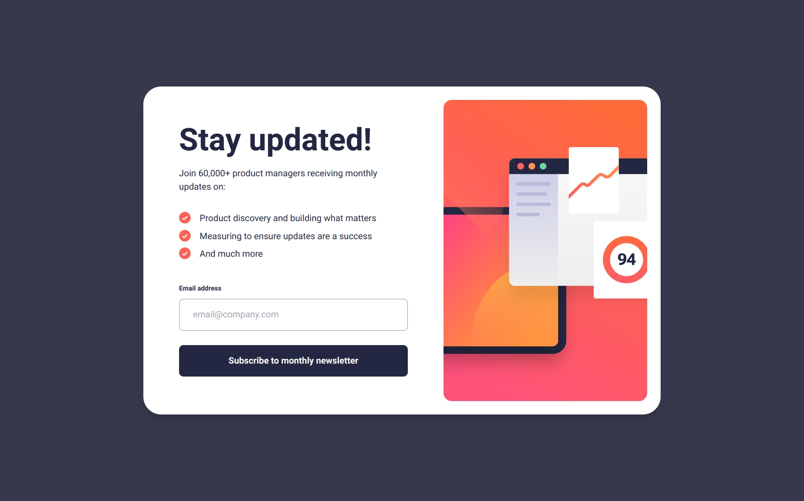
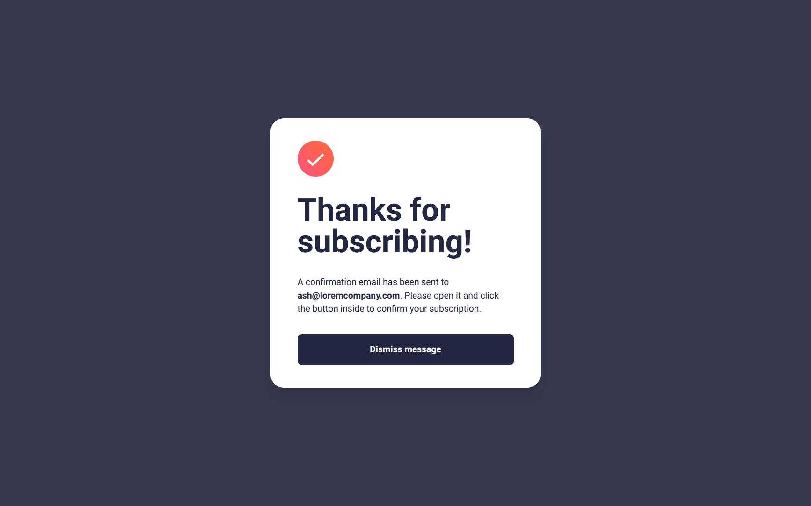
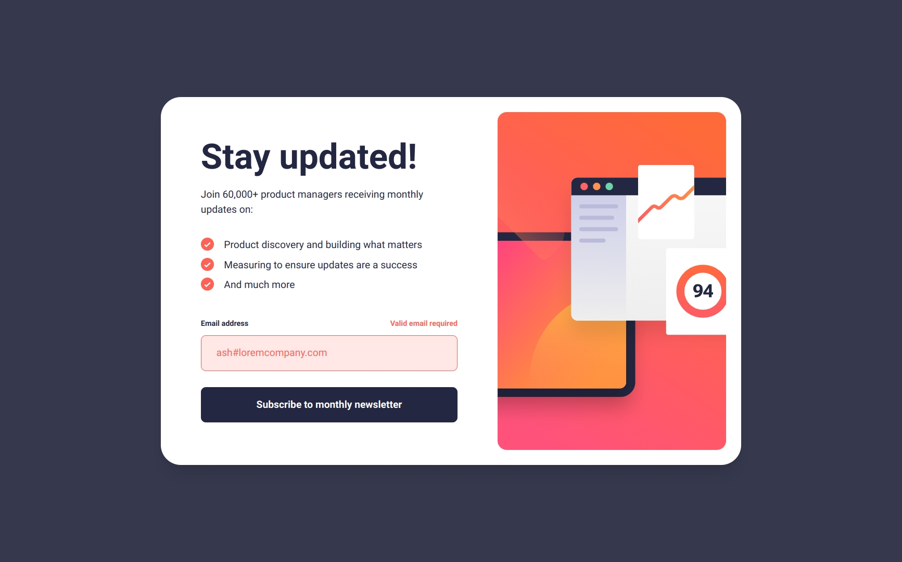
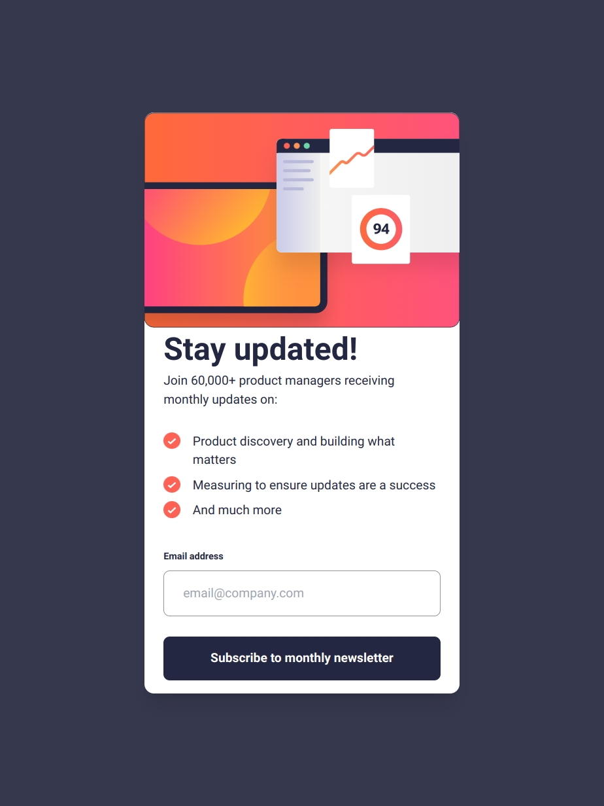
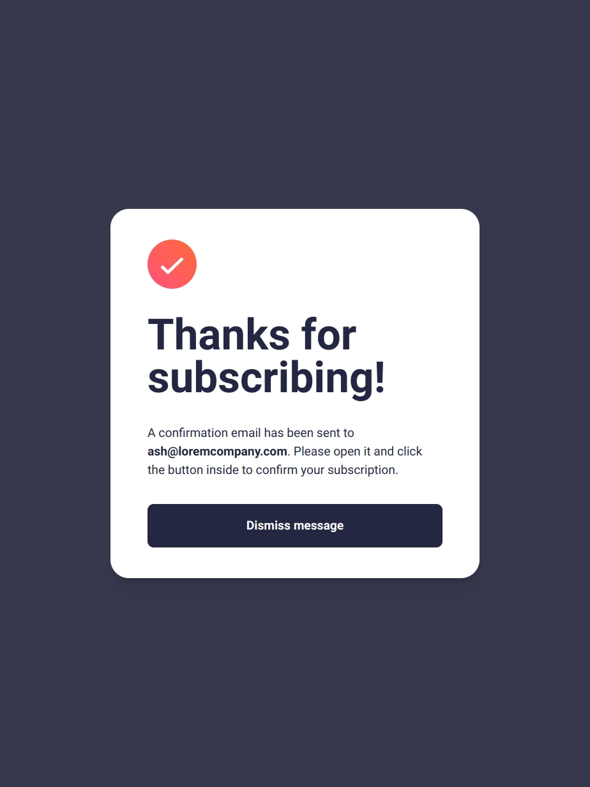
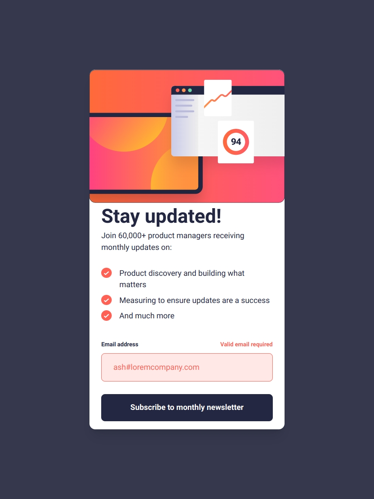
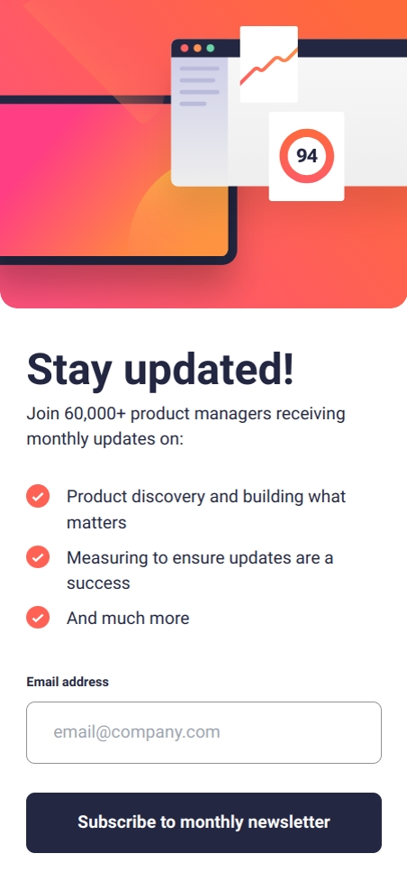
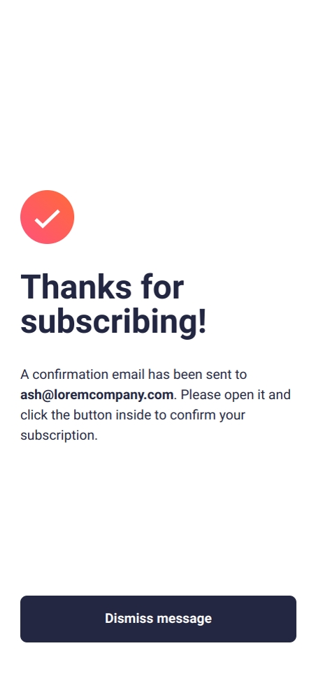

# Frontend Mentor - Newsletter sign-up form with success message solution

This is a solution to the [Newsletter sign-up form with success message challenge on Frontend Mentor](https://www.frontendmentor.io/challenges/newsletter-signup-form-with-success-message-3FC1AZbNrv). Frontend Mentor challenges help you improve your coding skills by building realistic projects. 

## Table of contents

- [Frontend Mentor - Newsletter sign-up form with success message solution](#frontend-mentor---newsletter-sign-up-form-with-success-message-solution)
  - [Table of contents](#table-of-contents)
  - [Overview](#overview)
    - [The challenge](#the-challenge)
    - [Screenshot](#screenshot)
    - [Links](#links)
  - [My process](#my-process)
    - [Built with](#built-with)
    - [What I learned](#what-i-learned)
    - [Continued development](#continued-development)
    - [Useful resources](#useful-resources)
  - [Author](#author)

## Overview

### The challenge

Users should be able to:

- Add their email and submit the form
- See a success message with their email after successfully submitting the form
- See form validation messages if:
  - The field is left empty
  - The email address is not formatted correctly
- View the optimal layout for the interface depending on their device's screen size
- See hover and focus states for all interactive elements on the page

### Screenshot
|Main View|Success View|Error View|
|---|---|---|
| |  | |
| |  | |
| |  | |

### Links

- Solution URL: [GitHub](https://github.com/Adamskiee/newsletter-sign-up)
- Live Site URL: [Website](https://adamskiee.github.io/newsletter-sign-up)
- Figma: [Figma](https://www.figma.com/design/FpvNxRpVcmbwqLq389m3RL/Newsletter-Signup?node-id=0-1&t=owhJHBwBo8NoU3oh-1)

## My process

### Built with

- Semantic HTML5 markup
- CSS custom properties
- Flexbox
- CSS Grid
- Mobile-first workflow
- [Tailwind](https://tailwindcss.com/) - CSS framework


### What I learned

1. Customizing error states of email input
```js
emailInput.addEventListener("invalid", (e)=>{
    let inputValue = e.target;
    if(inputValue.validity.typeMismatch || inputValue.validity.typeMismatch) {
        inputValue.setCustomValidity(" ");
        errorMsg.classList.remove("hidden");
        emailInput.classList.add("input-error");
    }
})
emailInput.addEventListener("input", (e)=> {
    errorMsg.classList.add("hidden");
    emailInput.classList.remove("input-error");
})
```

2. Picture Element
```html
<picture class="card__image">
  <source srcset="/assets/images/illustration-sign-up-desktop.svg" media="(min-width: 1139px)">
  <source srcset="/assets/images/illustration-sign-up-tablet.svg" media="(min-width: 768px)">
  <source srcset="/assets/images/illustration-sign-up-mobile.svg" media="(min-width: 0)">
  
</picture>
```

### Continued development

1. I want to enhance my skills on handling images when it is inside the flex/grid container.
2. I want to know if using CSS functions like `clamp()` is essential even if I am using CSS frameworks 

### Useful resources

- [thecodesharok](https://www.thecoderashok.com/blog/email-input-validation-using-javascript) - This helped me for customizing error states of email input.


## Author

- Frontend Mentor - [@Adamskiee](https://www.frontendmentor.io/profile/Adamskiee)
